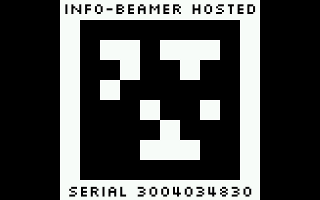

Configure a full video wall by just taking one picture
======================================================

Have a look at the demo video to get an idea of what
this video wall package is capable of:

Configure the screens
---------------------

After you imported this package into your account
you'll first have to create a setup based on it.
A setup allows you to create a video wall from
a collection of screens. If you want to create
multiple video walls, just create multiple setup.
In the setup you'll first have to click on the
**Assigned devices** tab and add all the screens
you want to use. Then click back to the **Configuration**
tab. You should see the screens you've just assigned.
The first thing you'll have to do now is click on
the **Save** button. This will instruct all assigned
devices to show a configuration tag. Each screen
should now show something like this:

The next step is to take a picture of all your screens
from the position of your future viewers. For example
stand directly in front of all your screens and take
a picture. Make sure all tags are visible.
Finally, click on **Upload/Capture Mapping Picture** and
select the picture you just created. On certain browsers
you can even create the picture by clicking this button.
After you've selected a picture it might take a moment
to automatically detect all the tags in the picture.
If everything was successful, all screens items in
the configuration interface should turn green.
Just click on **Save** again and you're ready to show
content on your video wall.

Changing the mapping
--------------------

If you're not satisfied with your configuration, just
click on **Map again**. This will remove the previous
mapping configuration and allows you to create a new
one. Make sure you click on **Save** so all screens
show the configuration tags again.

Hints
-----

You can have screens in any orientation. They can be
rotated in almost any direction as long as the tag
is still detectable by the configuration system.
Be aware that a wierd arrangement might only look good
from the position you took the mapping picture.

If you want to create a video wall that works from
any angle, be sure that all screen surfaces are
planar.

Make sure you get as close to your screens as
possible as the video/image you show on your screens
will be scaled according to the mapping picture
you took. The further you're away from the screen,
the less of the content you'll see on them later.

I'd suggest you just play around with them a bit to
get a feeling of how the mapping system works.

Set a playlist
--------------

Click on the node labeled **Playlist Configuration** on the
left side of the configuration screen.

You can add images and video assets to your playlist.
If you make changes to a playlist and click on **Save**, your
devices will go black for a short moment until they are all
back in sync. Therefore it is recommended to make all
changes to a playlist and save only once.

Release history
---------------

### Version 'preview'

This is the first public release. While it works, there
might be problems. If you find anything, please open an
issue on [github](https://github.com/info-beamer/package-magic-video-wall/issues/new).
